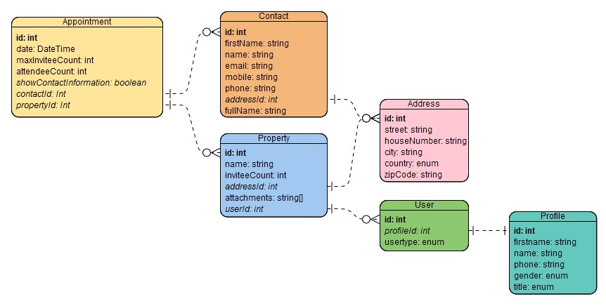

# LandlordCalendar

This project was generated with [Angular CLI](https://github.com/angular/angular-cli) version 11.1.2.
* Using Bootstrap 5

## Start
`npm run start` will start both, the client and mock-server.
Both will tell you in the console on which ports there listening, e.g.:
* Angular Live Development Server is listening on [localhost:4200](http://localhost:4200/)  
* Server running on port [http://localhost:14074/]( http://localhost:14074/)

## More sample data?
Please edit `/src/mockserver/helper.ts`

# DB Schema


*Created with Visual Paradigm Online Free Edition*

## Customizations / Problems

### Dependency errors (see [here](https://stackoverflow.com/questions/67433893/unable-to-resolve-dependency-tree-error-for-creating-new-angular-project)), changing versions:  
`jasmine-core` ⇒ `~3.8.0`  
`karma-jasmine-html-reporter` ⇒ `^1.7.0`  
*Maybe `@types/jasmine` should be changed too?*

### Dependency error with postcss-loader:  
`@angular-devkit/build-angular` ⇒ `~0.1102.13`

### Audit errors:
`npm audit fix --force`bumps @angular-devkit/build-angular to version ~13, which seems to make trouble!

### Node v17 error `ERR_OSSL_EVP_UNSUPPORTED`:
Fixed through `NODE_OPTIONS=--openssl-legacy-provider` (`npm run fix-ssl-error`).  
Change `start:client` to `"start:client": "npm run fix-ssl-error ng serve"` if needed

### momentPlugin (@fullcalendar/moment)
Added
```json
"allowSyntheticDefaultImports": true
```
to `tsconfig.json` under compilerOptions to fix import error inside @fullcalendar/moment
